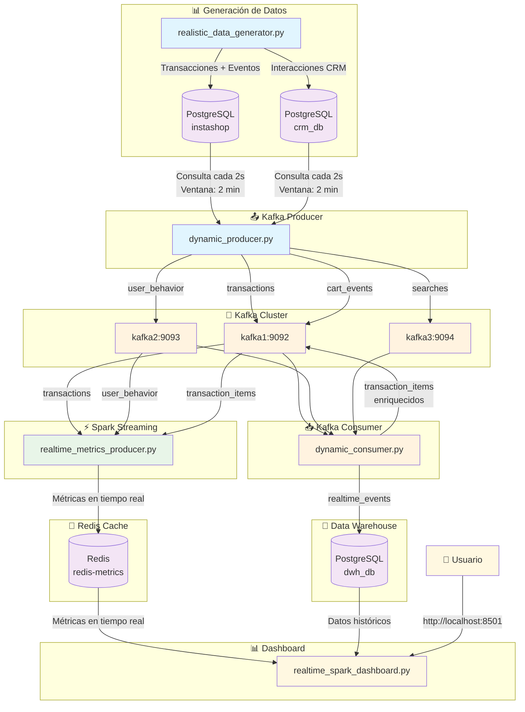

# 🏗️ InstaShop Big Data Pipeline - Arquitectura

## 📊 Diagrama de Arquitectura



## 🔄 Flujo de Datos Detallado

### **1. Generación de Datos (realistic_data_generator.py)**
```
┌─────────────────┐    ┌─────────────────┐
│   Generador     │───▶│   PostgreSQL    │
│   - Transacciones│    │   instashop     │
│   - Comportamiento│   │   crm_db        │
└─────────────────┘    └─────────────────┘
```

### **2. Producer Kafka (dynamic_producer.py)**
```
┌─────────────────┐    ┌─────────────────┐
│   PostgreSQL    │───▶│   Producer      │
│   - Consulta 2s │    │   - Sin duplicados│
│   - Ventana 2min│    │   - Todos topics│
└─────────────────┘    └─────────────────┘
```

### **3. Kafka Cluster**
```
┌─────────────────┐    ┌─────────────────┐
│   Producer      │───▶│   Kafka Topics  │
│                 │    │   - transactions │
│                 │    │   - user_behavior│
│                 │    │   - searches     │
│                 │    │   - cart_events  │
└─────────────────┘    └─────────────────┘
```

### **4. Consumer Kafka (dynamic_consumer.py)**
```
┌─────────────────┐    ┌─────────────────┐
│   Kafka Topics  │───▶│   Consumer      │
│                 │    │   - Group ID único│
│                 │    │   - earliest     │
│                 │    │   - commit manual│
└─────────────────┘    └─────────────────┘
```

### **5. Data Warehouse**
```
┌─────────────────┐    ┌─────────────────┐
│   Consumer      │───▶│   DWH PostgreSQL │
│                 │    │   - realtime_events│
│                 │    │   - Datos históricos│
└─────────────────┘    └─────────────────┘
```

### **6. Spark Streaming (realtime_metrics_producer.py)**
```
┌─────────────────┐    ┌─────────────────┐
│   Kafka Topics  │───▶│   Spark         │
│                 │    │   - Watermark 10s│
│                 │    │   - Ventana 30s │
│                 │    │   - Agregaciones│
└─────────────────┘    └─────────────────┘
```

### **7. Redis Cache**
```
┌─────────────────┐    ┌─────────────────┐
│   Spark         │───▶│   Redis         │
│                 │    │   - Métricas    │
│                 │    │   - TTL 1 hora  │
│                 │    │   - Tiempo real │
└─────────────────┘    └─────────────────┘
```

### **8. Dashboard (realtime_spark_dashboard.py)**
```
┌─────────────────┐    ┌─────────────────┐
│   Redis + DWH   │───▶│   Streamlit     │
│                 │    │   - Auto-refresh│
│                 │    │   - Gráficos    │
│                 │    │   - KPIs        │
└─────────────────┘    └─────────────────┘
```

## 🎯 Componentes por Puerto

| Componente | Puerto | Descripción |
|------------|--------|-------------|
| **PostgreSQL instashop** | 5432 | Base de datos principal |
| **PostgreSQL crm_db** | 5432 | Base de datos CRM |
| **PostgreSQL dwh_db** | 5436 | Data Warehouse |
| **Kafka kafka1** | 9092 | Broker Kafka 1 |
| **Kafka kafka2** | 9093 | Broker Kafka 2 |
| **Kafka kafka3** | 9094 | Broker Kafka 3 |
| **Redis** | 6379 | Cache de métricas |
| **Spark Master** | 8080 | UI de Spark |
| **Streamlit** | 8501 | Dashboard |

## 🔧 Configuraciones Clave

### **Generador**
- **Frecuencia**: 0.1 segundos
- **Distribución**: 70% transacciones, 30% comportamientos
- **Timestamps**: UTC
- **Auto-inicialización**: Tablas y datos básicos

### **Producer**
- **Consulta**: Cada 2 segundos
- **Ventana**: Últimos 2 minutos
- **Duplicados**: Sin protección (envía todo)
- **Topics**: transactions, user_behavior, searches, cart_events

### **Consumer**
- **Group ID**: Único por timestamp
- **Offset**: earliest (lee mensajes viejos)
- **Commit**: Manual después de procesar
- **Envío adicional**: transaction_items a Kafka

### **Spark**
- **Watermark**: 10 segundos
- **Ventana**: 30 segundos
- **Starting offsets**: earliest
- **Métricas**: Transacciones, comportamiento, productos

### **Dashboard**
- **Auto-refresh**: Cada 5 segundos
- **Fuentes**: Redis (tiempo real) + DWH (histórico)
- **Gráficos**: KPIs, productos, comportamiento, histórico
