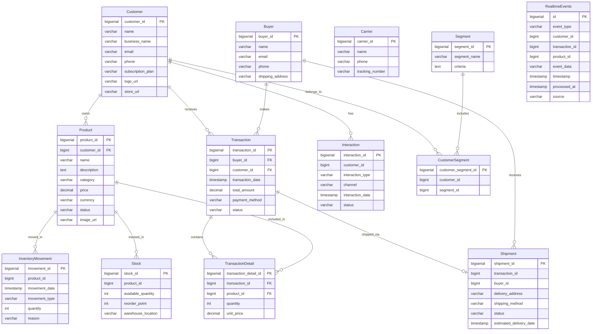
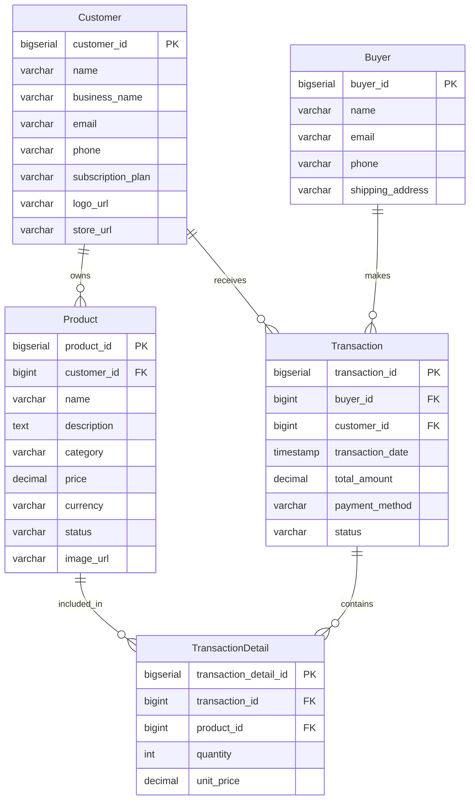
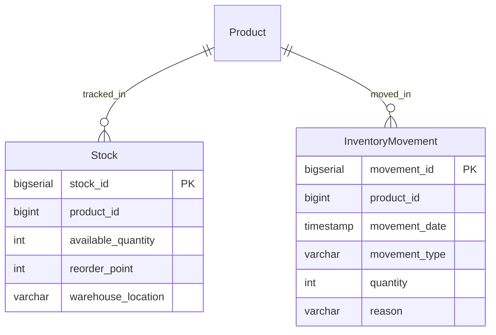
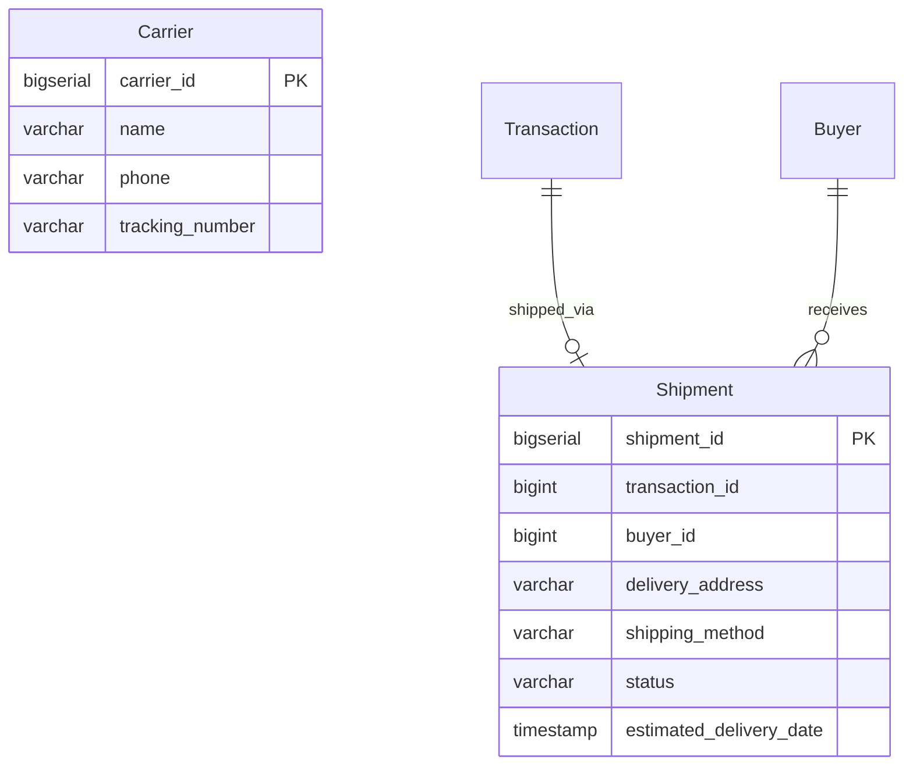
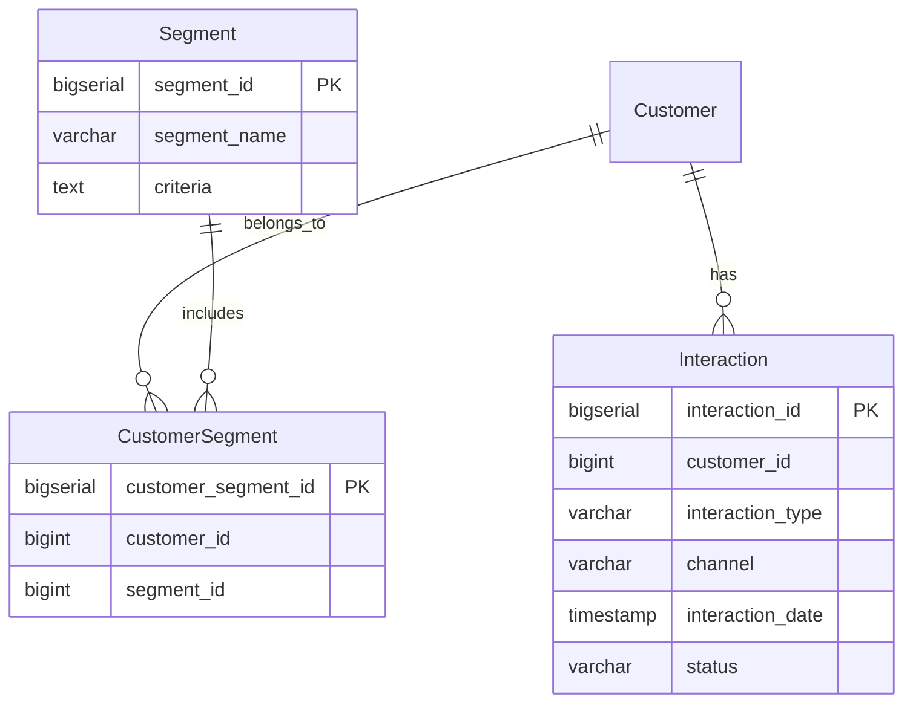
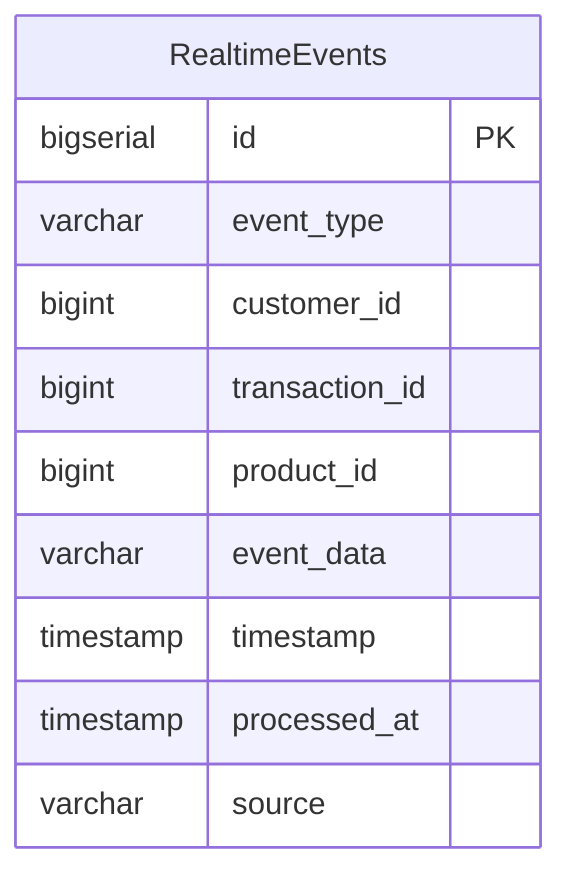

# 🗄️ InstaShop Database ERD - Diagrama Entidad-Relación

## 📊 Diagrama ERD Completo

## 🏗️ Estructura por Base de Datos

### **1. 📊 instashop (Puerto 5432) - E-commerce Principal**

### **2. 📦 erp_db (Puerto 5434) - Gestión de Inventario**

### **3. 🚚 ecommerce_db (Puerto 5435) - Logística**

### **4. 👥 crm_db (Puerto 5433) - Gestión de Clientes**

### **5. 🏢 dwh_db (Puerto 5436) - Data Warehouse**

## 📋 Descripción de Tablas

### **🏪 E-commerce Principal (instashop)**

| Tabla | Descripción | Campos Clave |
|-------|-------------|--------------|
| **Customer** | Clientes que venden productos | customer_id, name, business_name, subscription_plan |
| **Buyer** | Compradores que realizan compras | buyer_id, name, email, shipping_address |
| **Product** | Productos vendidos por clientes | product_id, customer_id, name, category, price |
| **Transaction** | Transacciones de compra | transaction_id, buyer_id, customer_id, total_amount |
| **TransactionDetail** | Detalles de productos en transacciones | transaction_detail_id, transaction_id, product_id, quantity |

### **📦 Gestión de Inventario (erp_db)**

| Tabla | Descripción | Campos Clave |
|-------|-------------|--------------|
| **Stock** | Control de inventario por producto | stock_id, product_id, available_quantity, reorder_point |
| **InventoryMovement** | Movimientos de inventario | movement_id, product_id, movement_type, quantity |

### **🚚 Logística (ecommerce_db)**

| Tabla | Descripción | Campos Clave |
|-------|-------------|--------------|
| **Carrier** | Empresas de transporte | carrier_id, name, tracking_number |
| **Shipment** | Envíos de productos | shipment_id, transaction_id, buyer_id, status |

### **👥 CRM (crm_db)**

| Tabla | Descripción | Campos Clave |
|-------|-------------|--------------|
| **Interaction** | Interacciones con clientes | interaction_id, customer_id, interaction_type, channel |
| **Segment** | Segmentos de clientes | segment_id, segment_name, criteria |
| **CustomerSegment** | Relación cliente-segmento | customer_segment_id, customer_id, segment_id |

### **🏢 Data Warehouse (dwh_db)**

| Tabla | Descripción | Campos Clave |
|-------|-------------|--------------|
| **RealtimeEvents** | Eventos en tiempo real procesados | id, event_type, customer_id, timestamp, source |

## 🔗 Relaciones Principales

1. **Customer** → **Product** (1:N) - Un cliente puede tener muchos productos
2. **Customer** → **Transaction** (1:N) - Un cliente puede recibir muchas transacciones
3. **Buyer** → **Transaction** (1:N) - Un comprador puede hacer muchas transacciones
4. **Transaction** → **TransactionDetail** (1:N) - Una transacción puede tener muchos detalles
5. **Product** → **TransactionDetail** (1:N) - Un producto puede estar en muchos detalles
6. **Customer** → **Interaction** (1:N) - Un cliente puede tener muchas interacciones
7. **Transaction** → **Shipment** (1:1) - Una transacción puede tener un envío

## 🎯 Tipos de Datos Utilizados

- **BIGSERIAL**: Claves primarias auto-incrementales
- **BIGINT**: Claves foráneas
- **VARCHAR**: Texto de longitud variable
- **TEXT**: Texto largo
- **DECIMAL(12,2)**: Números decimales para precios
- **TIMESTAMP**: Fechas y horas
- **INT**: Números enteros
