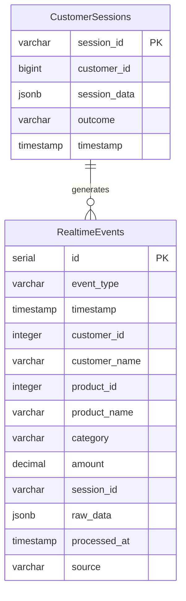
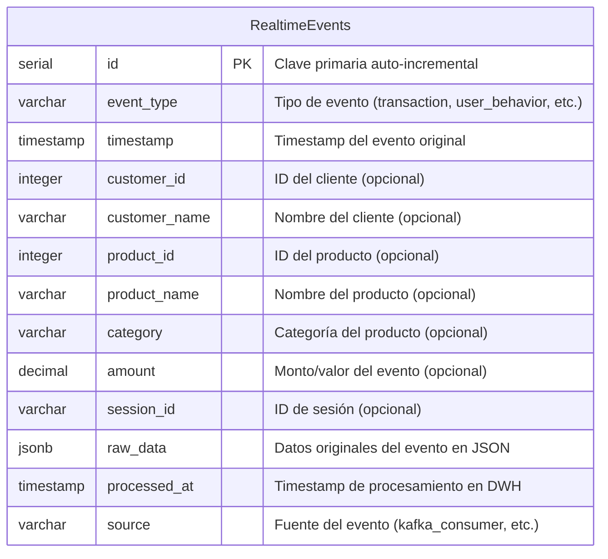
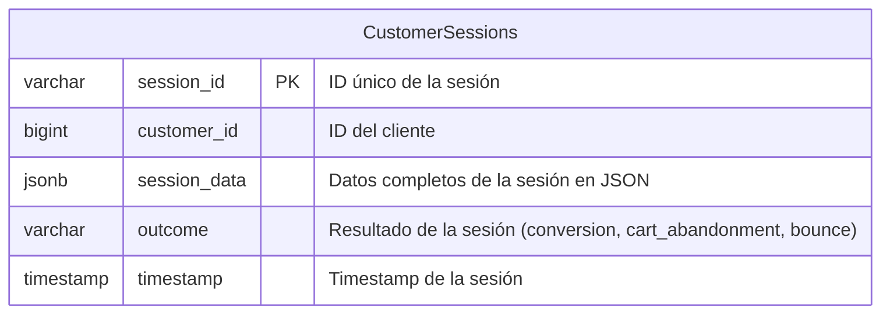
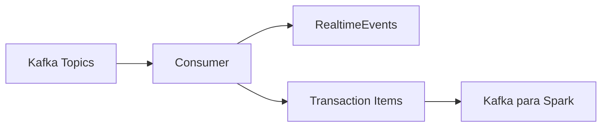
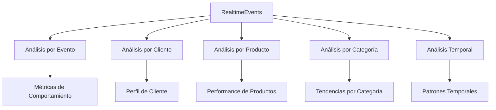
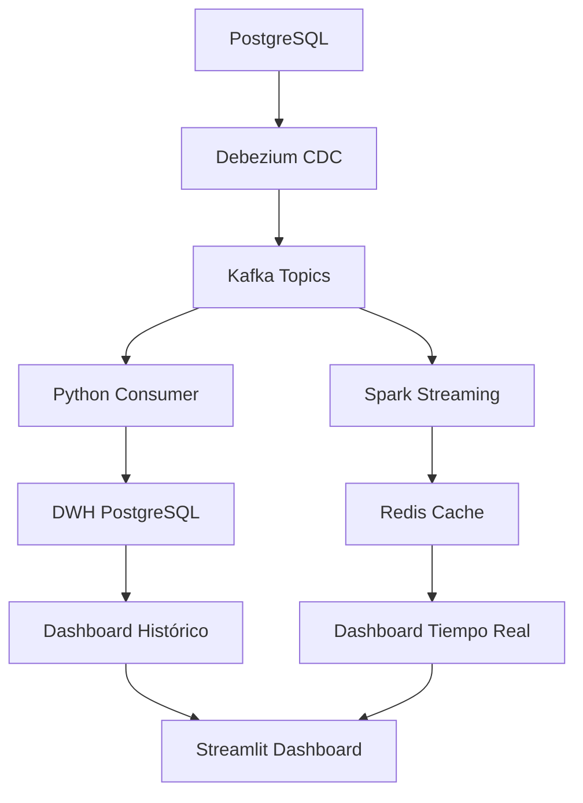

# 🏢 InstaShop Data Warehouse (DWH) - Diagrama Entidad-Relación

## 📊 DER del Data Warehouse - Dual Pipeline CDC



## 🏗️ Estructura Detallada del DWH

### **📊 Tabla: RealtimeEvents**



### **👥 Tabla: CustomerSessions**



## 📋 Descripción de Tablas del DWH

### **🔄 RealtimeEvents - Eventos en Tiempo Real**

| Campo | Tipo | Descripción | Ejemplo |
|-------|------|-------------|---------|
| **id** | SERIAL | Clave primaria auto-incremental | 1, 2, 3... |
| **event_type** | VARCHAR(50) | Tipo de evento procesado | `transaction`, `user_behavior`, `search`, `cart_event` |
| **timestamp** | TIMESTAMP | Fecha y hora del evento original | `2025-09-16 22:50:00` |
| **customer_id** | INTEGER | ID del cliente (opcional) | 28, 45, 67 |
| **customer_name** | VARCHAR(255) | Nombre del cliente (opcional) | `John Doe`, `Jane Smith` |
| **product_id** | INTEGER | ID del producto (opcional) | 15, 23, 89 |
| **product_name** | VARCHAR(255) | Nombre del producto (opcional) | `iPhone 15`, `Laptop Gaming` |
| **category** | VARCHAR(100) | Categoría del producto (opcional) | `Electronics`, `Clothing`, `Books` |
| **amount** | DECIMAL(12,2) | Monto/valor del evento (opcional) | 299.99, 150.50 |
| **session_id** | VARCHAR(255) | ID de sesión del usuario (opcional) | `sess_123`, `sess_456` |
| **raw_data** | JSONB | Datos originales del evento | `{"items": [...], "payment_method": "..."}` |
| **processed_at** | TIMESTAMP | Cuándo se procesó en el DWH | `2025-09-16 22:50:01` |
| **source** | VARCHAR(50) | Fuente del evento | `kafka_consumer`, `direct_insert` |

### **👥 CustomerSessions - Sesiones de Clientes**

| Campo | Tipo | Descripción | Ejemplo |
|-------|------|-------------|---------|
| **session_id** | VARCHAR(100) | ID único de la sesión | `sess_123`, `sess_456` |
| **customer_id** | BIGINT | ID del cliente | 28, 45, 67 |
| **session_data** | JSONB | Datos completos de la sesión | `{"start_time": "...", "pages": [...], "duration": 300}` |
| **outcome** | VARCHAR(50) | Resultado de la sesión | `conversion`, `cart_abandonment`, `bounce` |
| **timestamp** | TIMESTAMP | Timestamp de la sesión | `2025-09-16 22:50:00` |

## 🔄 Flujo de Datos hacia el DWH

### **1. 📥 Entrada desde Kafka Consumer**



### **2. 📊 Tipos de Eventos Procesados**

| Evento | Descripción | Campos Populados |
|--------|-------------|------------------|
| **transaction** | Evento principal de transacción | `customer_id`, `customer_name`, `amount`, `raw_data` |
| **transaction_item** | Item individual de transacción | `product_id`, `product_name`, `category`, `amount` |
| **user_behavior** | Comportamiento del usuario | `customer_id`, `session_id`, `raw_data` |
| **search** | Búsqueda realizada | `customer_id`, `session_id`, `raw_data` |
| **cart_event** | Evento de carrito | `customer_id`, `amount`, `session_id`, `raw_data` |

### **3. 🎯 Agregaciones y Análisis**



## 🔍 Consultas Típicas del DWH

### **📊 Métricas de Transacciones**
```sql
SELECT 
    DATE(timestamp) as fecha,
    COUNT(*) as total_transacciones,
    SUM(amount) as ingresos_totales,
    AVG(amount) as ticket_promedio
FROM realtime_events 
WHERE event_type = 'transaction'
GROUP BY DATE(timestamp)
ORDER BY fecha DESC;
```

### **👥 Análisis de Clientes**
```sql
SELECT 
    customer_id,
    customer_name,
    COUNT(*) as total_eventos,
    COUNT(CASE WHEN event_type = 'transaction' THEN 1 END) as transacciones,
    SUM(CASE WHEN event_type = 'transaction' THEN amount ELSE 0 END) as gasto_total
FROM realtime_events 
WHERE customer_id IS NOT NULL
GROUP BY customer_id, customer_name
ORDER BY gasto_total DESC;
```

### **🛍️ Performance de Productos**
```sql
SELECT 
    product_id,
    product_name,
    category,
    COUNT(*) as veces_vendido,
    SUM(amount) as ingresos_generados,
    AVG(amount) as precio_promedio
FROM realtime_events 
WHERE event_type = 'transaction_item'
GROUP BY product_id, product_name, category
ORDER BY ingresos_generados DESC;
```

### **📈 Análisis de Sesiones**
```sql
SELECT 
    outcome,
    COUNT(*) as total_sesiones,
    AVG(EXTRACT(EPOCH FROM (timestamp - (session_data->>'start_time')::timestamp))) as duracion_promedio
FROM customer_sessions 
GROUP BY outcome;
```

## 🎯 Características del DWH

### **✅ Ventajas del Diseño**
- **Flexibilidad**: JSONB permite almacenar estructuras variables
- **Trazabilidad**: `processed_at` y `source` para auditoría
- **Escalabilidad**: Índices en campos clave
- **Integración**: Compatible con herramientas de BI

### **🔧 Optimizaciones**
- **Índices**: En `timestamp`, `event_type`, `customer_id`, `product_id`
- **Particionado**: Por fecha para consultas históricas
- **Compresión**: JSONB optimizado para PostgreSQL
- **Retención**: Política de limpieza de datos antiguos

### **📊 Integración con Dashboard**
- **Redis**: Métricas en tiempo real desde Spark
- **DWH**: Datos históricos para análisis
- **Streamlit**: Visualización combinada de ambas fuentes

## 🚀 Dual Pipeline CDC - Uso en el Sistema

### **🔄 Flujo Completo CDC**



### **📊 Pipeline Histórico (DWH)**
1. **CDC Consumer** → Inserta eventos individuales en `RealtimeEvents`
2. **Datos Preservados** → Todos los eventos CDC almacenados
3. **Análisis Histórico** → Consultas SQL para tendencias y patrones
4. **Reportes** → Métricas a largo plazo y análisis temporal

### **⚡ Pipeline Tiempo Real (Redis)**
1. **Spark Streaming** → Procesa eventos CDC en tiempo real
2. **Métricas Calculadas** → Agregaciones y KPIs en Redis
3. **Dashboard Interactivo** → Visualizaciones actualizadas al instante
4. **Latencia Sub-segundo** → Respuesta inmediata a cambios

### **🎯 Beneficios del Dual Pipeline**
- **📊 Tiempo Real**: Dashboard responsivo con métricas actualizadas
- **🗄️ Histórico**: Datos preservados para análisis profundo
- **⚡ Escalabilidad**: Separación de responsabilidades
- **🔄 Resiliencia**: Fallback entre sistemas
- **🎨 Flexibilidad**: Diferentes latencias para diferentes necesidades

¡El DWH está optimizado para análisis en tiempo real e histórico con CDC! 🎉
